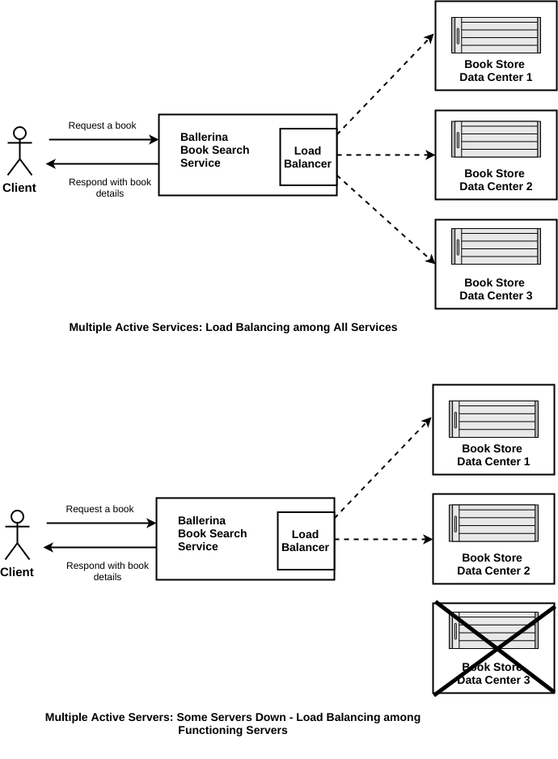

[](https://travis-ci.org/rosensilva/loadbalancing-failover)
# HTTP Load Balancing 
Load balancing is efficiently distributing incoming network traffic across a group of backend servers. The combination of load balancing and failover techniques will create highly available systems that efficiently distribute the workload among all the available resources. Ballerina language supports load balancing by default.

> This guide walks you through the process of adding load balancing for Ballerina programs.

The following are the sections available in this guide.

- [What you'll build](#what-you-build)
- [Prerequisites](#pre-req)
- [Developing the RESTFul service with load balancing and failover](#developing-service)
- [Testing](#testing)
- [Deployment](#deploying-the-scenario)
- [Observability](#observability)

## <a name="what-you-build"></a>  What you'll build

You’ll build a web service with load balancing. To understand this better, you'll be mapping this with a real-world scenario of a book searching service. The book searching service calls one of the three identical bookstore backends to retrieve the book details. With this guide you'll be able to understand how the load balancing mechanism helps to balance the load among all the available remote servers.



**Request book details from book search service**: To search for a new book you can use the HTTP GET request that contains the book name as a path parameter.

## <a name="pre-req"></a> Prerequisites
 
- JDK 1.8 or later
- [Ballerina Distribution](https://github.com/ballerina-lang/ballerina/blob/master/docs/quick-tour.md)
- A Text Editor or an IDE 

### Optional requirements
- Ballerina IDE plugins ([IntelliJ IDEA](https://plugins.jetbrains.com/plugin/9520-ballerina), [VSCode](https://marketplace.visualstudio.com/items?itemName=WSO2.Ballerina), [Atom](https://atom.io/packages/language-ballerina))
- [Docker](https://docs.docker.com/engine/installation/)

## <a name="developing-service"></a> Developing the RESTFul service with a load balancer

### Before you begin

#### Understand the package structure
Ballerina is a complete programming language that can have any custom project structure that you wish. Although the language allows you to have any package structure, use the following package structure for this project to follow this guide.

```
└── src
    ├── book_search
    │   ├── book_search_service.bal
    │   └── tests
    │       └── book_search_service_test.bal
    └── book_store_backed
        └── book_store_service.bal

```

The `book_search` is the service that handles the client orders to find books from bookstores. The book search service calls bookstore backends to retrieve book details. You can see that the load balancing technique is applied when the book search service calls one from the three identical backend servers.

The `book_store_backed` service has an independent web service that accepts orders via HTTP POST method from `book_search_service.bal` and sends the details of the book back to the `book_search_service.bal`.

### Implementation of the Ballerina services

#### book_search_service.bal
The `ballerina/net.http` package contains the load balancer implementation. After importing that package you can create an endpoint with a load balancer. The `endpoint` keyword in Ballerina refers to a connection with a remote service. Here you'll have three identical remote services to load balance across. 

First, create an endpoint `bookStoreEndPoints` with the array of HTTP clients that need to be load balanced across. Whenever you call the `bookStoreEndPoints` remote HTTP endpoint, it goes through the load balancer. 

```ballerina
package book_search;

import ballerina/net.http;

// Create an endpoint with port 9090 for the book search service
endpoint http:ServiceEndpoint bookSearchServiceEP {
    port:9090
};

// Define the end point to the book store backend
endpoint http:ClientEndpoint bookStoreBackends {
    targets:[
            // Create an array of HTTP Clients that needs to be Load balanced across
            {uri:"http://localhost:9011/book-store"},
            {uri:"http://localhost:9012/book-store"},
            {uri:"http://localhost:9013/book-store"}
            ]
};

@http:ServiceConfig {basePath:"book"}
service<http:Service> bookSearchService bind bookSearchServiceEP {
    @http:ResourceConfig {
    // Set the bookName as a path parameter
        path:"/{bookName}"
    }
    bookSearchService (endpoint conn, http:Request req, string bookName) {
        // Initialize the request and response messages for the remote call
        http:Request outRequest = {};
        http:Response outResponse = {};

        // Set the json payload with the book name
        json requestPayload = {"bookName":bookName};
        outRequest.setJsonPayload(requestPayload);
        // Call the book store backend with load balancer
        var backendResponse = bookStoreBackends -> post("/", outRequest);
        // Match the response from the backed to check whether the response received
        match backendResponse {
        // Check the response is a http response
            http:Response inResponse => {
            // forward the response received from book store back end to client
                _ = conn -> forward(inResponse);
            }
            http:HttpConnectorError httpConnectorError => {
            // Send the response back to the client if book store back end fails
                outResponse.statusCode = httpConnectorError.statusCode;
                outResponse.setStringPayload(httpConnectorError.message);
                _ = conn -> respond(outResponse);
            }
        }
    }
}


```

Refer to the complete implementaion of the orderService in the [loadbalancing-failover/booksearchservice/book_search_service.bal](/src/book_search/book_search_service.bal) file.


#### book_store_service.bal
The book store service is a mock service that gives details about the requested book. This service is a simple service that accepts
HTTP POST requests with the following JSON payload.

```json
 {"bookName":"Name of the book"}
```

It then responds with the following JSON.

```json
{
 "Served by Data Ceter" : "1",
 "Book Details" : {
     "Title":"Book titile",
     "Author":"Stephen King",
     "ISBN":"978-3-16-148410-0",
     "Availability":"Available"
 }
}
```

Refer to the complete implementation of the book store service in the [loadbalance-failover/bookstorebacked/book_store_service.bal](src/book_store_backed/book_store_service.bal) file.

## <a name="testing"></a> Testing 


### Try it out
#### Load balancer
1. Run the book search service by running the following command in the terminal from the `SAMPLE_ROOT/src` directory.
    ```bash
    $ ballerina run booksearchservice/
   ```

2. Next, run the three instances of the book store service. Here you have to enter the service port number in each service instance. You can pass the port number as parameter `Bport=<Port Number>`.
   ``` bash
   // 1st instance with port number 9011
   $ ballerina run bookstorebacked/ -Bport=9011
   ```
   
    ``` bash
    // 2nd instance with port number 9012
    $ ballerina run bookstorebacked/ -Bport=9012
   ```
   
    ``` bash
    // 3rd instance with port number 9013
    $ ballerina run bookstorebacked/ -Bport=9013
   ```
   With that, all the required services for this guide should be up and running.
  
3. Invoke the book search service by sending the following HTTP GET request to the book search service.
   ```bash
   curl -X GET http://localhost:9090/book/Carrie
   ```
   You should see a response silmilar to the following.
   ```json
   {"Served by Data Ceter":1,"Book Details":{"Title":"Carrie","Author":"Stephen King","ISBN":"978-3-16-148410-   0","Availability":"Available"}}
   ```
   The`"Served by Data Ceter":1` entry says that the 1st instance of book store backend has been invoked to find the book details.

4. Repeat the above request three times. You should see the responses as follows.

   ```json
   {"Served by Data Ceter":2,"Book Details":{"Title":"Carrie","Author":"Stephen King","ISBN":"978-3-16-148410-   0","Availability":"Available"}}
   ```
   ```json
   {"Served by Data Ceter":3,"Book Details":{"Title":"Carrie","Author":"Stephen King","ISBN":"978-3-16-148410-   0","Availability":"Available"}}
   ```
   ```json
   {"Served by Data Ceter":1,"Book Details":{"Title":"Carrie","Author":"Stephen King","ISBN":"978-3-16-148410-   0","Availability":"Available"}}
   ```

You can see that the book search service has invoked the book store backed with the round robin load balancing pattern. The `"Served by Data Ceter"` repeats using the following pattern: 1 -> 2 -> 3 -> 1.


#### Load balancer: some servers down

1.  Now shut down the third instance of the book store service by terminating the following instance.
    ```bash
    // 3rd instance with port number 9013
    $ ballerina run bookstorebacked/ -Bport=9013
    // Terminate this from the terminal
    ``` 
2.  Then send following request repeatedly three times,
    ```bash
    curl -X GET http://localhost:9090/book/Carrie
    ```  
3.  The responses for above requests should look similar to,
    ```json
    {"Served by Data Ceter":1,"Book Details":{"Title":"Carrie","Author":"Stephen King","ISBN":"978-3-16-148410-    0","Availability":"Available"}}
    ```
    ```json
    {"Served by Data Ceter":2,"Book Details":{"Title":"Carrie","Author":"Stephen King","ISBN":"978-3-16-148410-   0","Availability":"Available"}}
    ```
    ```json
    {"Served by Data Ceter":1,"Book Details":{"Title":"Carrie","Author":"Stephen King","ISBN":"978-3-16-148410-   0","Availability":"Available"}}
    ```
   
4. This means that the loadbalancer is preventing the third instance from getting invoked since the third instance is shut down. In the meantime you'll see the order of `"Served by Data Ceter"` is similar to the 1 -> 2 -> 1 pattern.
 
 ### <a name="unit-testing"></a> Writing unit tests 

In Ballerina, the unit test cases should be in the same package under the `tests` folder .
The naming convention should be as follows.
* Test files should contain the _test.bal suffix.
* Test functions should contain the test prefix.
  * e.g., testBookStoreService()

This guide contains unit test cases in the respective folders. 

To run the unit tests, go to the `SAMPLE_ROOT/src` and run the following command.
```bash
$ ballerina test
```
## <a name="deploying-the-scenario"></a> Deployment

Once you are done with the development, you can deploy the service using any of the methods listed below. 

### <a name="deploying-on-locally"></a> Deploying locally
You can deploy the RESTful service that you developed above in your local environment. You can create the Ballerina executable archive (.balx) first and then run it in your local environment as follows.

**Building** 
Navigate to `SAMPLE_ROOT/src` and run the following commands
   ```bash
    $ ballerina build book_store_backed/

    $ ballerina build book_search/

   ```

**Running**
   ```bash
    $ ballerina run book_store_backed.balx

    $ ballerina run book_search.balx -Bport=9011

   ```

### <a name="deploying-on-docker"></a> Deploying on Docker
(Work in progress) 

### <a name="deploying-on-k8s"></a> Deploying on Kubernetes
(Work in progress) 


## <a name="observability"></a> Observability 

### <a name="logging"></a> Logging
(Work in progress) 

### <a name="metrics"></a> Metrics
(Work in progress) 


### <a name="tracing"></a> Tracing 
(Work in progress) 
