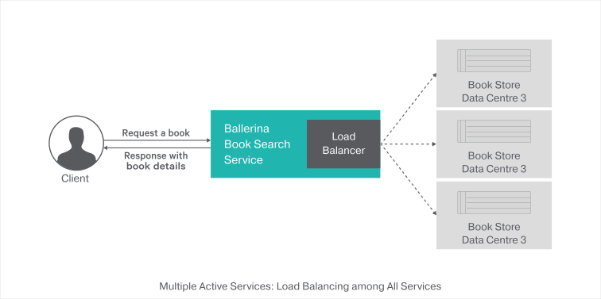
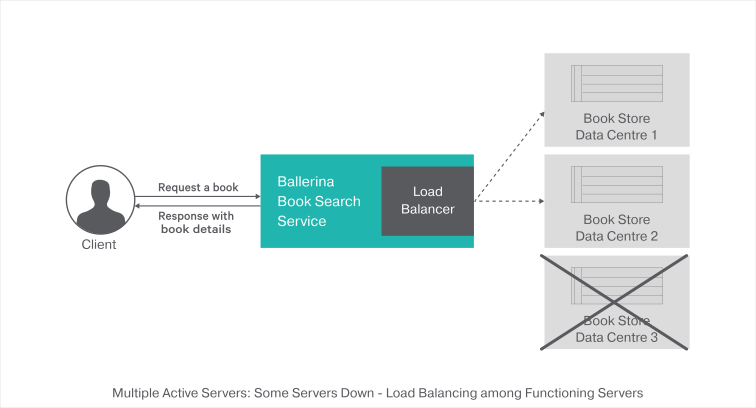

[](https://travis-ci.org/ballerina-guides/loadbalancing-failover)

# Load Balancing 
Load balancing is efficiently distributing incoming network traffic across a group of backend servers. The combination of load balancing and failover techniques will create highly available systems that efficiently distribute the workload among all the available resources. Ballerina language supports load balancing by default.

> This guide walks you through the process of adding load balancing for Ballerina programs.

The following are the sections available in this guide.

- [What you'll build](#what-youll-build)
- [Prerequisites](#prerequisites)
- [Implementation](#implementation)
- [Testing](#testing)
- [Deployment](#deployment)
- [Observability](#observability)

## What you'll build

You’ll build a web service with load balancing. To understand this better, you'll be mapping this with a real-world scenario of a book searching service. The book searching service calls one of the three identical bookstore backends to retrieve the book details. With this guide you'll be able to understand how the load balancing mechanism helps to balance the load among all the available remote servers.




**Request book details from book search service**: To search for a new book you can use the HTTP GET request that contains the book name as a path parameter.

## Prerequisites
 
- [Ballerina Distribution](https://ballerina.io/learn/getting-started/)
- A Text Editor or an IDE 
> **Tip**: For a better development experience, install one of the following Ballerina IDE plugins: [VSCode](https://marketplace.visualstudio.com/items?itemName=ballerina.ballerina), [IntelliJ IDEA](https://plugins.jetbrains.com/plugin/9520-ballerina)

### Optional requirements
- [Docker](https://docs.docker.com/engine/installation/)
- [Kubernetes](https://kubernetes.io/docs/setup/)

## Implementation

> If you want to skip the basics, you can download the git repo and directly move to the "Testing" section by skipping  "Implementation" section.

### Create the project structure

Ballerina is a complete programming language that can have any custom project structure that you wish. Although the language allows you to have any module structure, use the following module structure for this project to follow this guide.
```
loadbalancing-failover
 └── guide/
      ├── book_search
      |   ├── book_search_service.bal
      |   └── tests
      |       └── book_search_service_test.bal
      └── book_store_backend
          └── book_store_service.bal
```

- Create the above directories in your local machine and also create empty `.bal` files.

- Then open the terminal and navigate to `loadbalancing-failover/guide` and run Ballerina project initializing toolkit.
```bash
   $ ballerina init
```


The `book_search` is the service that handles the client orders to find books from bookstores. The book search service calls bookstore backends to retrieve book details. You can see that the load balancing technique is applied when the book search service calls one from the three identical backend servers.

The `book_store_backend` service has an independent web service that accepts orders via HTTP POST method from `book_search_service.bal` and sends the details of the book back to the `book_search_service.bal`.

### Developing the RESTFul service with a load balancer


The `ballerina/http` module contains the load balancer implementation. After importing that module you can create an endpoint with a load balancer. The `endpoint` keyword in Ballerina refers to a connection with a remote service.`endpoint http:LoadBalanceClient` is the HTTP client with loadbalancer. 

First, create an endpoint `bookStoreEndPoints` with the array of HTTP clients that need to be load balanced across. Whenever you call the `bookStoreEndPoints` remote HTTP endpoint, it goes through the load balancer. 

#### book_search_service.bal
```ballerina
// Copyright (c) 2018 WSO2 Inc. (http://www.wso2.org) All Rights Reserved.
//
// WSO2 Inc. licenses this file to you under the Apache License,
// Version 2.0 (the "License"); you may not use this file except
// in compliance with the License.
// You may obtain a copy of the License at
//
// http://www.apache.org/licenses/LICENSE-2.0
//
// Unless required by applicable law or agreed to in writing,
// software distributed under the License is distributed on an
// "AS IS" BASIS, WITHOUT WARRANTIES OR CONDITIONS OF ANY
// KIND, either express or implied.  See the License for the
// specific language governing permissions and limitations
// under the License.

import ballerina/http;
import ballerina/log;
//import ballerinax/docker;
//import ballerinax/kubernetes;

//@docker:Config {
//    registry:"ballerina.guides.io",
//    name:"book_search_service",
//    tag:"v1.0"
//}

//@kubernetes:Ingress {
//    hostname:"ballerina.guides.io",
//    name:"ballerina-guides-book-search-service",
//    path:"/"
//}
//
//@kubernetes:Service {
//    serviceType:"NodePort",
//    name:"ballerina-guides-book-search-service"
//}
//
//@kubernetes:Deployment {
//    image:"ballerina.guides.io/book_search_service:v1.0",
//    name:"ballerina-guides-book-search-service"
//}

// Create an endpoint with port 9090 for the book search service
listener http:Listener bookSearchServiceEP = new(9090);

// Define the load balance client endpoint to call the backend services.
http:LoadBalanceClient bookStoreBackends = new({
    targets: [
        // Create an array of HTTP Clients that needs to be Load balanced across
        { url: "http://localhost:9011/book-store" },
        { url: "http://localhost:9012/book-store" },
        { url: "http://localhost:9013/book-store" }
    ]
});

@http:ServiceConfig {
    basePath: "book"
}
service BookSearch on bookSearchServiceEP {
    @http:ResourceConfig {
        // Set the bookName as a path parameter
        path: "/{bookName}"
    }
    resource function bookSearchService(http:Caller caller, http:Request req, string bookName) {
        // Initialize the request and response messages for the remote call
        http:Request outRequest = new;
        http:Response outResponse = new;

        // Set the json payload with the book name
        json requestPayload = {
            "bookName": bookName
        };
        outRequest.setPayload(untaint requestPayload);
        // Call the book store backend with load balancer
        var backendResponse = bookStoreBackends->post("/", outRequest);
        if (backendResponse is http:Response) {
            //Forward the response received from the book store back end to the client
            var result = caller->respond(backendResponse);
            handleError(result);
        } else {
            //Send the response back to the client if book store back end fails
            var payload = backendResponse.detail().message;
            if (payload is error) {
                handleError(payload);
            } else {
                outResponse.setPayload(string.convert(payload));
                var result = caller->respond(outResponse);
                handleError(result);
            }

        }
    }
}

function handleError(error? result) {
    if (result is error) {
        log:printError(result.reason(), err = result);
    }
}
```


#### book_store_service.bal
The book store service is a mock service that gives details about the requested book. This service is a simple service that accepts
HTTP POST requests with the following JSON payload.

```json
 {"bookName":"Name of the book"}
```

It then responds with the following JSON.

```json
{
 "Served by Data Ceter" : "1",
 "Book Details" : {
     "Title":"Book titile",
     "Author":"Stephen King",
     "ISBN":"978-3-16-148410-0",
     "Availability":"Available"
 }
}
```

Refer to the complete implementation of the book store service in the [book_store_service.bal](guide/book_store_backend/book_store_service.bal) file.

## Testing 


### Try it out
#### Load balancer
1. Run the book search service by running the following command in the terminal from the `SAMPLE_ROOT/src` directory.
```bash
$ ballerina run book_search/
```

2. Next, run the three instances of the book store service. Here you have to enter the service port number in each service instance. You can pass the port number as parameter `Bport=<Port Number>`.
``` bash
// 1st instance with port number 9011
$ ballerina run -e port=9011 book_store_backend 
```

``` bash
// 2nd instance with port number 9012
$ ballerina run -e port=9012 book_store_backend 
```

``` bash
// 3rd instance with port number 9013
$ ballerina run -e port=9013 book_store_backend 
```
   With that, all the required services for this guide should be up and running.
  
3. Invoke the book search service by sending the following HTTP GET request to the book search service.
```bash
curl -X GET http://localhost:9090/book/Carrie
```
You should see a response silmilar to the following.
```json
{"Served by Data Ceter":1,"Book Details":{"Title":"Carrie","Author":"Stephen King"
,"ISBN":"978-3-16-148410-   0","Availability":"Available"}}
```
   The`"Served by Data Ceter":1` entry says that the 1st instance of book store backend has been invoked to find the book details.

- Repeat the above request three times. You should see the responses as follows.

```json
{"Served by Data Ceter":2,"Book Details":{"Title":"Carrie","Author":"Stephen King",
"ISBN":"978-3-16-148410-   0","Availability":"Available"}}
```
```json
{"Served by Data Ceter":3,"Book Details":{"Title":"Carrie","Author":"Stephen King",
"ISBN":"978-3-16-148410-   0","Availability":"Available"}}
```
```json
{"Served by Data Ceter":1,"Book Details":{"Title":"Carrie","Author":"Stephen King",
"ISBN":"978-3-16-148410-   0","Availability":"Available"}}
```

You can see that the book search service has invoked the book store backed with the round robin load balancing pattern. The `"Served by Data Ceter"` repeats using the following pattern: 1 -> 2 -> 3 -> 1.


#### Load balancer: some servers down

1.  Now shut down the third instance of the book store service by terminating the following instance.
```bash
// 3rd instance with port number 9013
$ ballerina run -e port=9013 book_store_backend 
// Terminate this from the terminal
``` 
2.  Then send following request repeatedly three times,
```bash
curl -X GET http://localhost:9090/book/Carrie
```  
3.  The responses for above requests should look similar to,
```json
{"Served by Data Ceter":1,"Book Details":{"Title":"Carrie","Author":"Stephen King",
"ISBN":"978-3-16-148410-    0","Availability":"Available"}}
```
```json
{"Served by Data Ceter":2,"Book Details":{"Title":"Carrie","Author":"Stephen King",
"ISBN":"978-3-16-148410-   0","Availability":"Available"}}
```
```json
{"Served by Data Ceter":1,"Book Details":{"Title":"Carrie","Author":"Stephen King",
"ISBN":"978-3-16-148410-   0","Availability":"Available"}}
```
   
- This means that the loadbalancer is preventing the third instance from getting invoked since the third instance is shut down. if you observe the response you can see that the order of the `"Served by Data Ceter"` is similar to 1 -> 2 -> 1 pattern.
 
### Writing unit tests 

In Ballerina, the unit test cases should be in the same module inside a folder named as 'tests'.  When writing the test functions the below convention should be followed.
- Test functions should be annotated with `@test:Config`. See the below example.
```ballerina
   @test:Config
   function testBookSearch() {
```

To run the unit tests, open your terminal and navigate to `loadbalancing-failover/guide`, and run the following command.
```bash
$ ballerina test
```

To check the implementation of the test file, refer to the `tests` directories in the [repository](https://github.com/ballerina-guides/loadbalancing-failover).

## Deployment

Once you are done with the development, you can deploy the service using any of the methods listed below. 

### Deploying locally

- As the first step, you can build a Ballerina executable archive (.balx) of the service that we developed above. Navigate to `loadbalancing-failover/guide` and run the following command. 
```bash
   $ ballerina build book_search/
```
```bash
   $ ballerina build book_store_backend/
```

- Once the balx files are created inside the target folder, you can run that with the following command. 
```
   $ ballerina run target/book_search.balx
```
```
   $ ballerina run -e port=9011 target/book_store_backend.balx 
```

### Deploying on Docker

You can run the services that we developed above as a docker container. As Ballerina platform offers native support for running ballerina programs on containers, you just need to put the corresponding docker annotations on your service code. 
Let's see how we can deploy the book_search_service we developed above on docker. 

- In our book_search_service, we need to import  `` import ballerinax/docker; `` and use the annotation `` @docker:Config `` as shown below to enable docker image generation during the build time. 

##### book_search_service.bal
```ballerina
import ballerina/http;
import ballerinax/docker;

@docker:Config {
    registry:"ballerina.guides.io",
    name:"book_search_service",
    tag:"v1.0"
}

listener http:ServiceEndpoint bookSearchServiceEP = new(9090);

// http:ClientEndpoint definition for the bookstore backend

@http:ServiceConfig {basePath:"book"}
service<http:Service> BookSearch bind bookSearchServiceEP {
``` 
- Update the URLs specified in the load balancing client with the correct IP addresses so that the docker container can access it properly

- Now you can build a Ballerina executable archive (.balx) of the service that we developed above, using the following command. It points to the service file that we have developed above and it creates an executable binary out of that. 
This also creates the corresponding docker image using the docker annotations you have configured above. Navigate to the `<SAMPLE_ROOT>/guide/` folder and run the following command.  
  
```
$ballerina build book_search
```
Run following command to start docker container: 
```
docker run -d -p 9090:9090 ballerina.guides.io/book_search_service:v1.0
```
- Once you successfully build the docker image, you can run it with the `` docker run`` command that is shown in the previous step.  

```   
docker run -d -p 9090:9090 ballerina.guides.io/book_search_service:v1.0
```
Here we run the docker image with flag`` -p <host_port>:<container_port>`` so that we use the host port 9090 and the container port 9090. Therefore you can access the service through the host port. 

- Verify docker container is running with the use of `` $ docker ps``. The status of the docker container should be shown as 'Up'. 
- Find the IP of the container using `` $ docker inspect <container_id>``
- Use the following command to access the service running in docker. 
 
```
curl -X GET http://<IP_ADDRESS_OF_THE_CONTAINER>:9090/book/Carrie
```


### Deploying on Kubernetes

- You can run the services that we have developed above, on Kubernetes. The Ballerina language offers native support for running ballerina programs on Kubernetes, 
with the use of Kubernetes annotations which you can include as part of your service code. Also, it takes care of the creation of the docker images. 
So you don't need to explicitly create docker images prior to deploying it on Kubernetes.   
Let's see how we can deploy the book_search_service we developed above on kubernetes.

- We need to import `` import ballerinax/kubernetes; `` and use `` @kubernetes `` annotations as shown below to enable kubernetes deployment for the service we have developed above. 

> NOTE: Linux users can use Minikube to try this out locally.

##### book_search_service.bal

```ballerina
module book_search;

import ballerina/http;
import ballerinax/kubernetes;

@kubernetes:Ingress {
    hostname:"ballerina.guides.io",
    name:"ballerina-guides-book-search-service",
    path:"/"
}

@kubernetes:Service {
    serviceType:"NodePort",
    name:"ballerina-guides-book-search-service"
}

@kubernetes:Deployment {
    image:"ballerina.guides.io/book_search_service:v1.0",
    name:"ballerina-guides-book-search-service"
}

listener http:Listener bookSearchServiceEP = new(9090);

// http:ClientEndpoint definition for the bookstore backend

@http:ServiceConfig {basePath:"book"}
service bookSearchService on bookSearchServiceEP {
``` 

- Here we have used ``  @kubernetes:Deployment `` to specify the docker image name that gets created as a part of building this service. 
- We have also specified `` @kubernetes:Service {} `` so that it creates a Kubernetes service which exposes the Ballerina service that is running on a Pod.  
- In addition we have used `` @kubernetes:Ingress `` which is the external interface to access your service (with path `` /`` and host name ``ballerina.guides.io``)

If you are using Minikube, you need to set a couple of additional attributes to the `@kubernetes:Deployment` annotation.
- `dockerCertPath` - The path to the certificates directory of Minikube (e.g., `/home/ballerina/.minikube/certs`).
- `dockerHost` - The host for the running cluster (e.g., `tcp://192.168.99.100:2376`). The IP address of the cluster can be found by running the `minikube ip` command.
 
- Now you can build a Ballerina executable archive (.balx) of the service that we developed above, using the following command. It points to the service file that we have developed above and it creates an executable binary out of that. 
This also creates the corresponding docker image and the Kubernetes artifacts using the Kubernetes annotations that you have configured above.
  
```
$ballerina build book_search
```
Run following command to deploy kubernetes artifacts:  
```
kubectl apply -f ./target/kubernetes/book_search
```

- You can verify that the docker image that we specified in `` @kubernetes:Deployment `` is created, by using `` docker ps images ``. 
- Also the Kubernetes artifacts related to our service, are generated in `` ./target/kubernetes/book_search``. 
- Now you can create the Kubernetes deployment using:

```
 $ kubectl apply -f ./target/kubernetes/book_search
   deployment.extensions "ballerina-guides-book-search-service" created
   ingress.extensions "ballerina-guides-book-search-service" created
   service "ballerina-guides-book-search-service" created
```

- You can verify Kubernetes deployment, service and ingress are running properly, by using following Kubernetes commands. 
```
$kubectl get service
$kubectl get deploy
$kubectl get pods
$kubectl get ingress
```

- If everything is successfully deployed, you can invoke the service either via Node port or ingress. 

Node Port:
 
```
 curl -X GET http://<Minikube_host_IP>:<Node_Port>/book/Carrie
```
If you are using Minikube, you should use the IP address of the Minikube cluster obtained by running the `minikube ip` command. The port should be the node port given when running the `kubectl get services` command.

Ingress:

Add `/etc/hosts` entry to match hostname. For Minikube, the IP address should be the IP address of the cluster.
``` 
127.0.0.1 ballerina.guides.io
```

Access the service 

``` 
 curl -X GET http://ballerina.guides.io/book/Carrie 
```

## Observability 
Ballerina is by default observable. Meaning you can easily observe your services, resources, etc.
However, observability is disabled by default via configuration. Observability can be enabled by adding following configurations to `ballerina.conf` file and starting the ballerina service using it. A sample configuration file can be found in `loadbalancing-failover/guide/book_search`.

```ballerina
[b7a.observability]

[b7a.observability.metrics]
# Flag to enable Metrics
enabled=true

[b7a.observability.tracing]
# Flag to enable Tracing
enabled=true
```

To start the ballerina service using the configuration file, run the following command
```
   $ ballerina run --config book_search/ballerina.conf book_search/
```

NOTE: The above configuration is the minimum configuration needed to enable tracing and metrics. With these configurations default values are load as the other configuration parameters of metrics and tracing.

### Tracing 

You can monitor ballerina services using in built tracing capabilities of Ballerina. We'll use [Jaeger](https://github.com/jaegertracing/jaeger) as the distributed tracing system.
Follow the following steps to use tracing with Ballerina.

- You can add the following configurations for tracing. Note that these configurations are optional if you already have the basic configuration in `ballerina.conf` as described above.
```
   [b7a.observability]

   [b7a.observability.tracing]
   enabled=true
   name="jaeger"

   [b7a.observability.tracing.jaeger]
   reporter.hostname="localhost"
   reporter.port=5775
   sampler.param=1.0
   sampler.type="const"
   reporter.flush.interval.ms=2000
   reporter.log.spans=true
   reporter.max.buffer.spans=1000
```

- Run Jaeger docker image using the following command
```bash
   $ docker run -d -p5775:5775/udp -p6831:6831/udp -p6832:6832/udp -p5778:5778 -p16686:16686 \
   -p14268:14268 jaegertracing/all-in-one:latest
```

- Navigate to `loadbalancing-failover/guide` and run the restful-service using the following command
```
   $ ballerina run --config book_search/ballerina.conf book_search/
```

- Observe the tracing using Jaeger UI using following URL
```
   http://localhost:16686
```

### Metrics
Metrics and alerts are built-in with ballerina. We will use Prometheus as the monitoring tool.
Follow the below steps to set up Prometheus and view metrics for Ballerina restful service.

- You can add the following configurations for metrics. Note that these configurations are optional if you already have the basic configuration in `ballerina.conf` as described under `Observability` section.

```
   [b7a.observability.metrics]
   enabled=true
   reporter="prometheus"

   [b7a.observability.metrics.prometheus]
   port=9797
   host="0.0.0.0"
```

- Create a file `prometheus.yml` inside `/tmp/` location. Add the below configurations to the `prometheus.yml` file.
```
   global:
     scrape_interval:     15s
     evaluation_interval: 15s

   scrape_configs:
     - job_name: prometheus
       static_configs:
         - targets: ['172.17.0.1:9797']
```

   NOTE : Replace `172.17.0.1` if your local docker IP differs from `172.17.0.1`
   
- Run the Prometheus docker image using the following command
```
   $ docker run -p 19090:9090 -v /tmp/prometheus.yml:/etc/prometheus/prometheus.yml \
   prom/prometheus
```

- Navigate to `loadbalancing-failover/guide` and run the restful-service using the following command
```
   $ ballerina run --config book_search/ballerina.conf book_search/
```

- You can access Prometheus at the following URL
```
   http://localhost:19090/
```

NOTE:  Ballerina will by default have following metrics for HTTP server connector. You can enter following expression in Prometheus UI
-  http_requests_total
-  http_response_time


### Logging

Ballerina has a log module for logging to the console. You can import ballerina/log module and start logging. The following section will describe how to search, analyze, and visualize logs in real time using Elastic Stack.

- Start the Ballerina Service with the following command from `loadbalancing-failover/guide`
```
   $ nohup ballerina run book_search/ &>> ballerina.log&
```
   NOTE: This will write the console log to the `ballerina.log` file in the `loadbalancing-failover/guide` directory

- Start Elasticsearch using the following command

- Start Elasticsearch using the following command
```
   $ docker run -p 9200:9200 -p 9300:9300 -it -h elasticsearch --name \
   elasticsearch docker.elastic.co/elasticsearch/elasticsearch:6.5.1 
```

   NOTE: Linux users might need to run `sudo sysctl -w vm.max_map_count=262144` to increase `vm.max_map_count` 
   
- Start Kibana plugin for data visualization with Elasticsearch
```
   $ docker run -p 5601:5601 -h kibana --name kibana --link \
   elasticsearch:elasticsearch docker.elastic.co/kibana/kibana:6.5.1    
```

- Configure logstash to format the ballerina logs

i) Create a file named `logstash.conf` with the following content
```
input {  
 beats{ 
     port => 5044 
 }  
}

filter {  
 grok{  
     match => { 
	 "message" => "%{TIMESTAMP_ISO8601:date}%{SPACE}%{WORD:logLevel}%{SPACE}
	 \[%{GREEDYDATA:package}\]%{SPACE}\-%{SPACE}%{GREEDYDATA:logMessage}"
     }  
 }  
}   

output {  
 elasticsearch{  
     hosts => "elasticsearch:9200"  
     index => "store"  
     document_type => "store_logs"  
 }  
}  
```

ii) Save the above `logstash.conf` inside a directory named as `{SAMPLE_ROOT}\pipeline`
     
iii) Start the logstash container, replace the `{SAMPLE_ROOT}` with your directory name
     
```
$ docker run -h logstash --name logstash --link elasticsearch:elasticsearch \
-it --rm -v ~/{SAMPLE_ROOT}/pipeline:/usr/share/logstash/pipeline/ \
-p 5044:5044 docker.elastic.co/logstash/logstash:6.5.1
```
  
 - Configure filebeat to ship the ballerina logs
    
i) Create a file named `filebeat.yml` with the following content
```
filebeat.prospectors:
- type: log
  paths:
    - /usr/share/filebeat/ballerina.log
output.logstash:
  hosts: ["logstash:5044"]  
```
NOTE : Modify the ownership of filebeat.yml file using `$chmod go-w filebeat.yml` 

ii) Save the above `filebeat.yml` inside a directory named as `{SAMPLE_ROOT}\filebeat`   
        
iii) Start the logstash container, replace the `{SAMPLE_ROOT}` with your directory name
     
```
$ docker run -v {SAMPLE_ROOT}/filbeat/filebeat.yml:/usr/share/filebeat/filebeat.yml \
-v {SAMPLE_ROOT}/loadbalancing-failover/book_search/ballerina.log:/usr/share\
/filebeat/ballerina.log --link logstash:logstash docker.elastic.co/beats/filebeat:6.5.1
```
 
 - Access Kibana to visualize the logs using following URL
```
   http://localhost:5601 
```
